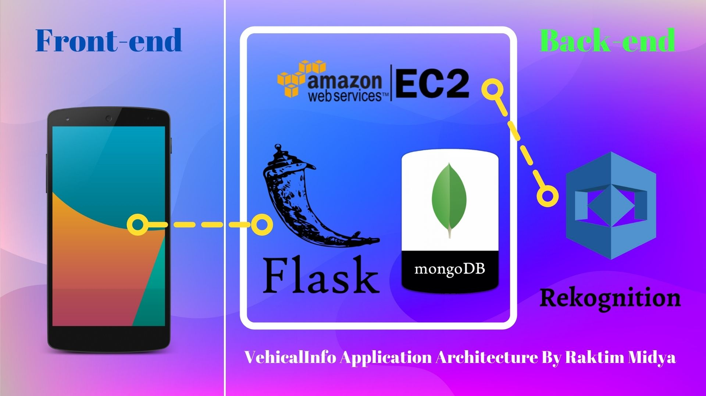

# Vehicle Owner Information Application
## Project Description :
- This is an Mobile Application created using Flutter Framework.
- In back-end we are using Flask Python APIs which can contact to MongoDB & Amazon Rekognition Service.
- Mobile App is taking one vehicle image from the User & sending it to Flask API.
- Then Flask is sending that Image to Amazon Rekognition Service to extract the texts from it. Then we are doing RegeX search to find possible text that can be a Vehicle Number.
- Then Flask is doing the query on MongoDB database using the Vehical Number found. Finally it's returning the MongoDB output to the Mobile App.
- Lastly Mobile App is showing us the details.

### To see the video demonstration follow the link : https://youtu.be/moW0f4wmNpk

## The Architecture of VehicalInfo Application Look like :

